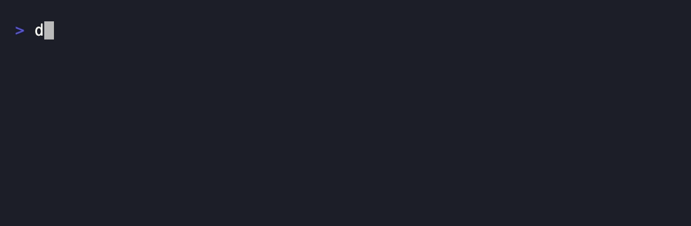

# llm_sdk

> La trousse à outils de référence pour faire dialoguer une app Dart / Flutter
> avec n'importe quelle IA. **Une seule interface, plusieurs cerveaux
> interchangeables.**

Côté web (JS) il existe une trousse polie pour parler aux LLM (style Vercel AI
SDK). Côté Dart / Flutter, rien d'équivalent : chacun rebricole sa plomberie.
`llm_sdk` est ce pont propre — multi-provider, streaming, tool calling et
sorties structurées derrière **une** API.

### Changer d'IA = changer une ligne


### Streaming, mot à mot



## Les 4 briques

| Brique | Ce que ça fait |
|---|---|
| **Multi-provider** | Les mêmes « boutons » quel que soit le fournisseur derrière. |
| **Streaming** | Afficher la réponse mot à mot, en direct. |
| **Tool calling** | L'IA demande d'exécuter des fonctions ; le SDK orchestre l'aller-retour. |
| **Sorties structurées** | L'IA remplit un objet Dart typé au lieu de rendre du texte libre. |

## Changer d'IA = changer une ligne

```dart
final client = LlmClient(ClaudeProvider(apiKey: maCle));
// ... ou, sans toucher à une seule autre ligne :
final client = LlmClient(OpenAIProvider(apiKey: maCle));
final client = LlmClient(GeminiProvider(apiKey: maCle));
```

## Streaming

```dart
await for (final mot in client.streamText([Message.user('Raconte une blague')])) {
  stdout.write(mot); // effet machine à écrire
}
```

## Tool calling

```dart
final meteo = Tool(
  name: 'getMeteo',
  description: "Donne la météo actuelle d'une ville",
  parameters: {
    'type': 'object',
    'properties': {'ville': {'type': 'string'}},
    'required': ['ville'],
  },
  run: (args) async => '29 °C et humide à ${args['ville']}',
);

final reponse = await client.generate(
  [Message.user('Quel temps fait-il à Douala ?')],
  tools: [meteo],
);
print(reponse.text); // "Il fait 29 °C et humide à Douala."
```

Le SDK boucle automatiquement (borné par `maxSteps`) : l'IA demande →
`getMeteo` s'exécute → le résultat repart à l'IA → réponse finale.

## Sorties structurées

```dart
class Facture {
  final String client;
  final double montant;
  Facture(this.client, this.montant);
  factory Facture.fromJson(Map<String, dynamic> j) =>
      Facture(j['client'] as String, (j['montant'] as num).toDouble());
}

final facture = await client.generateObject<Facture>(
  [Message.user('Facture pour Metchera, 1 250 € TTC.')],
  schema: {
    'type': 'object',
    'properties': {
      'client': {'type': 'string'},
      'montant': {'type': 'number'},
    },
    'required': ['client', 'montant'],
  },
  fromJson: Facture.fromJson,
);
print(facture.client);  // "Metchera"
print(facture.montant); // 1250.0
```

> Pas de réflexion runtime en Flutter : le schéma JSON et le `fromJson` sont
> manuels en v1. Codegen via annotation prévu plus tard.

## Architecture

Le contrat se résume à **deux méthodes** (`generate`, `generateStream`) que
chaque provider implémente. Toute la logique d'usage — boucle d'outils,
`streamText`, `generateObject` — est construite **une seule fois** dans le
`LlmClient`, par-dessus le contrat. Les providers restent minces : ils ne font
que traduire vers/depuis leur dialecte.

```
LlmClient  ── boucle d'outils, streamText, generateObject
   │
   └── LlmProvider (contrat : generate + generateStream)
         ├── ClaudeProvider   ✅ (texte, tools, sorties structurées, streaming SSE)
         ├── OpenAIProvider   ✅ (idem, dialecte Chat Completions)
         └── GeminiProvider   ✅ (idem, dialecte generateContent)
```

## État (v0.3.0)

- ✅ Noyau agnostique : types, contrat, `LlmClient` (boucle d'outils,
  `generateObject`, `streamText`).
- ✅ Les **3 adaptateurs** (Claude, OpenAI, Gemini) complets : `generate`,
  tool calling, sorties structurées (via tool forcé), streaming SSE.
- ✅ 29 tests (logique client mockée + aller/retour/SSE des 3 providers).
- 🎯 Les 4 briques tiennent sur les 3 providers **sans aucun changement au
  noyau** — l'abstraction *est* le produit, et elle a tenu.
- ⬜ Hors v1 : embeddings, vision/audio, coûts, cache, retries, agents
  multi-étapes au-delà de la boucle d'outils.

### Limite v1 assumée

Combiner streaming **et** outils simultanément est reporté : la boucle d'outils
auto vit sur `generate` (chemin `Future`) ; `streamText` reste simple.

## Tester

```bash
dart pub get
dart test
```
